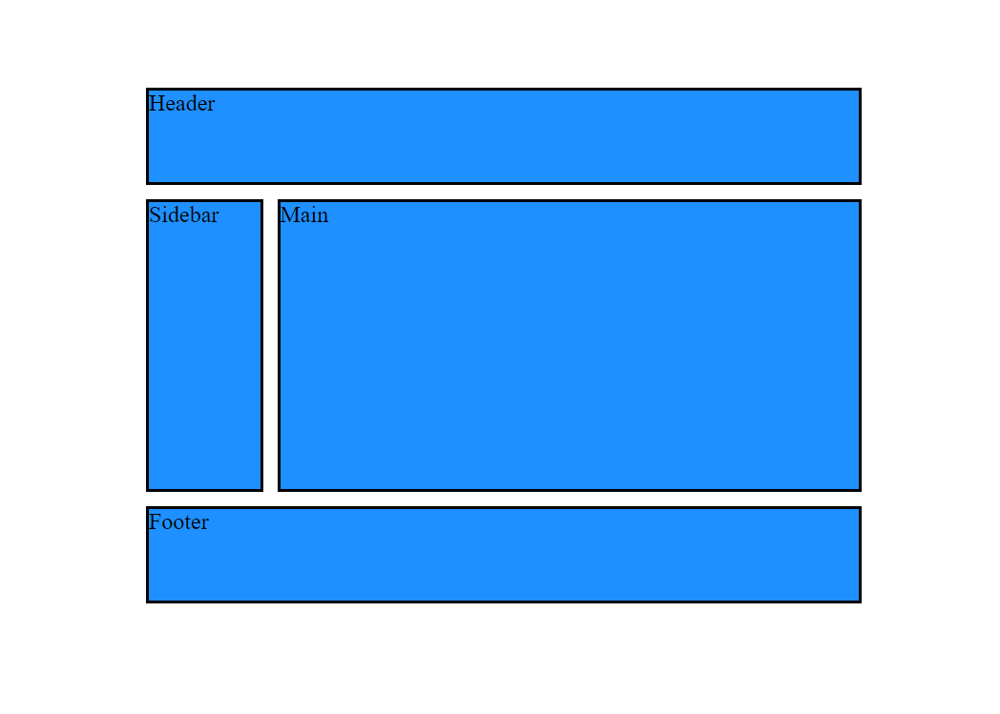
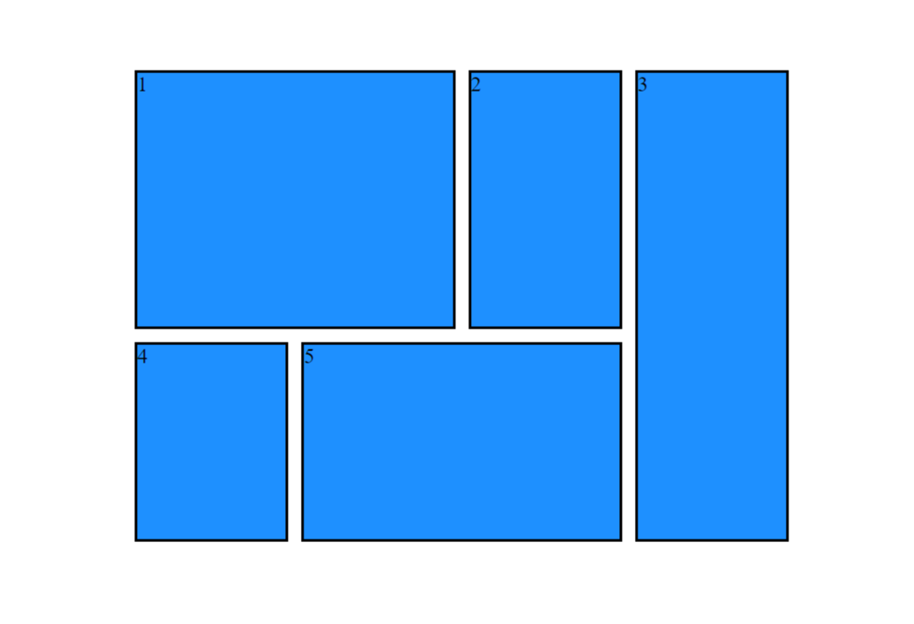
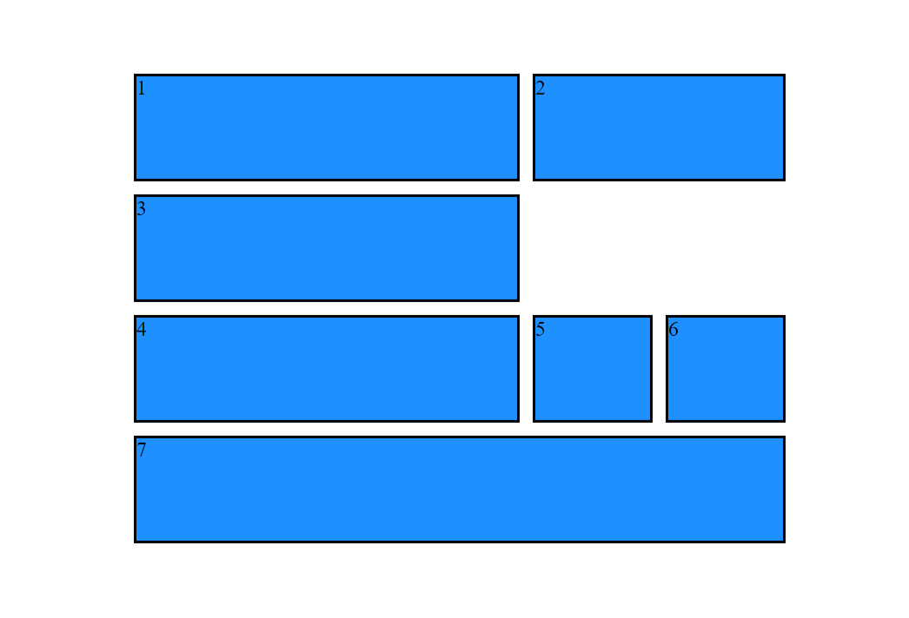
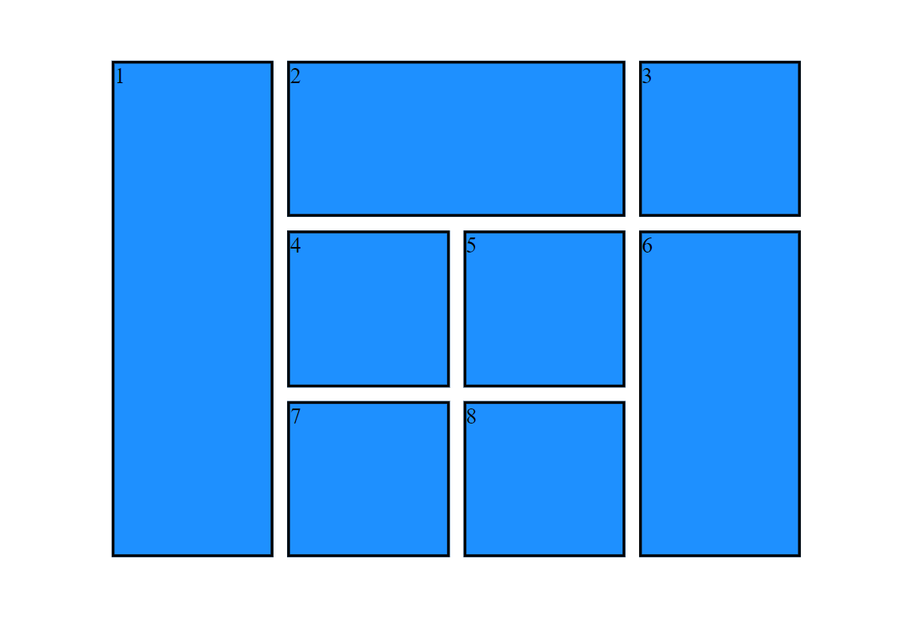
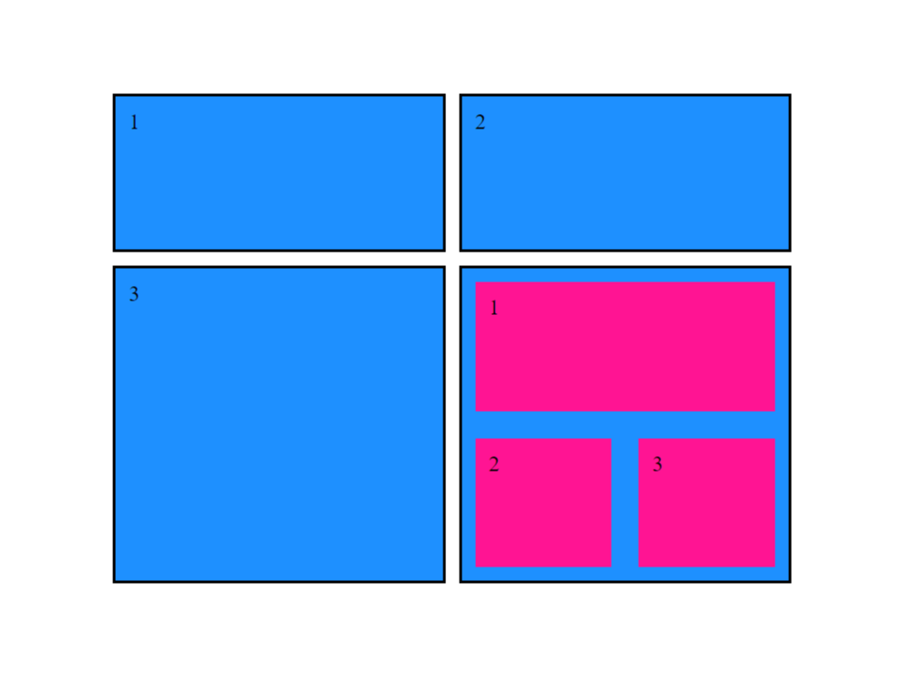

# BSE-CSS-GRID  :art: :art: 

We require you to solve the following tasks. Remember to read the requirements first.

**Note:** The html and css files you need to work on have been added to the repository. The images to be used in solving the tasks are placed in the images folder.

#### Topics you need to know and use to solve tasks

* CSS Grid

**Final Notes**: *Remember to solve and send assignments on time* :hourglass_flowing_sand:

## Assignment  :star:  :star:  :star:  :star: :star:

Aşağıda göstərilmiş şəkillərə uyğun olaraq Css-Grid qurun 

